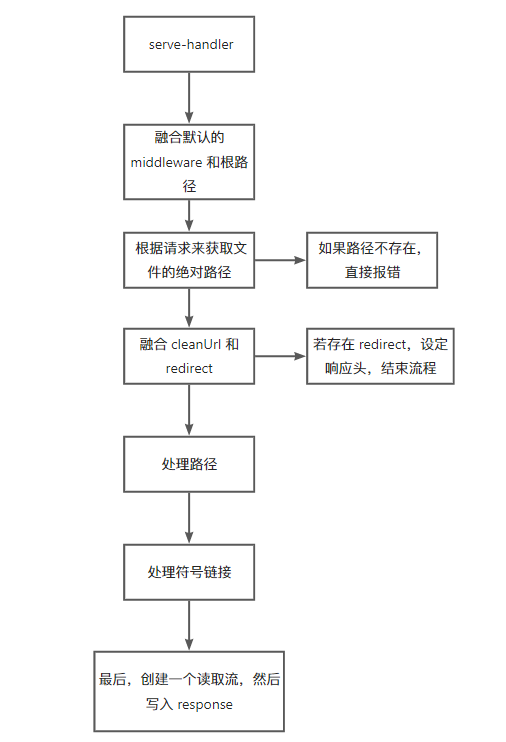

# 源码解析

## 主流程



### 一些关键处理流程

可以看 [index.test.ts](./__test__/index.test.ts) 来查看完整的测试样例

可以看 [src](./src/) 来看完整的实现

#### 启动

核心代码可以直接浓缩为以下几行：

```ts
const cwd = getCurrentWorkDir()
// 根据 request.url 来找文件
const path = resolve(cwd, request.url!.slice(1))
// 文件不存在，走 404 处理
if (!existsSync(path))
  processError(404, response)
// 文件存在，那么直接走文件处理流程
else
  createReadStream(path).pipe(response)
```

#### redirect

redirect 最简单的实现 —— 根据配置文件来判断，并走 301 即可

```ts
// redirect 的结构： { from: string, to: string }[]
export default function (request: IncomingMessage, response: ServerResponse, opts?: Opts) {
  // process redirect
  if (opts && opts.redirect) {
    const { redirect } = opts
    const redirectTarget = redirect.find(item => item.origin === relatedPath)
    if (redirectTarget)
      processRedirect(response, redirectTarget.target)
  }
}

export function processRedirect(response: ServerResponse, target: string): void {
  const defaultType = 301
  // 处理即可
  response.writeHead(defaultType, 'Moved Permanently', {
    Location: target,
  })
  response.end()
}
```

#### rewrites

那么在极简的实现中，redirects 和 rewrites 的实现原理也是差不多的
